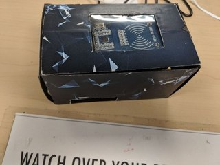

# Morse-Decoder-GUI
Morse code decoder GUI in python, made for NTU orientation camp

This code uses both python 2 and python 3 libraries, and is optimised to run on raspberry pi.

Libraries used include (python3):  
tkinter, PIL, pyqrcode, and RPi.GPIO, pypng  

## Features

The GUI is able to encode/decode between morse code and english, with detailed instructions on how to use it in the introduction message.
Since the GUI is designed as part of an orientation camp game, the raspberry pi is connected to a RC522 RFID card reader module, and will read the information on a RFID card to open a designated audio file that plays a morse code segment. The players will have to listen to the morse code audio, and use the GUI to decode the morse code to win the game.

The RFID cards are hidden in locked boxes around the game area, with players having to solve a puzzle to open the lock.

## Tips to run the code
For import error regarding imageTk, type "sudo apt-get install python3-pil.imagetk" into terminal.

To give permissions to folders, type "sudo chmod 755 -R dirname"

Setup with RC522 card reader can be found at https://pimylifeup.com/raspberry-pi-rfid-rc522/

This program also uses vlc player. Type "sudo apt-get install vlc" into terminal to install in raspberry pi.
